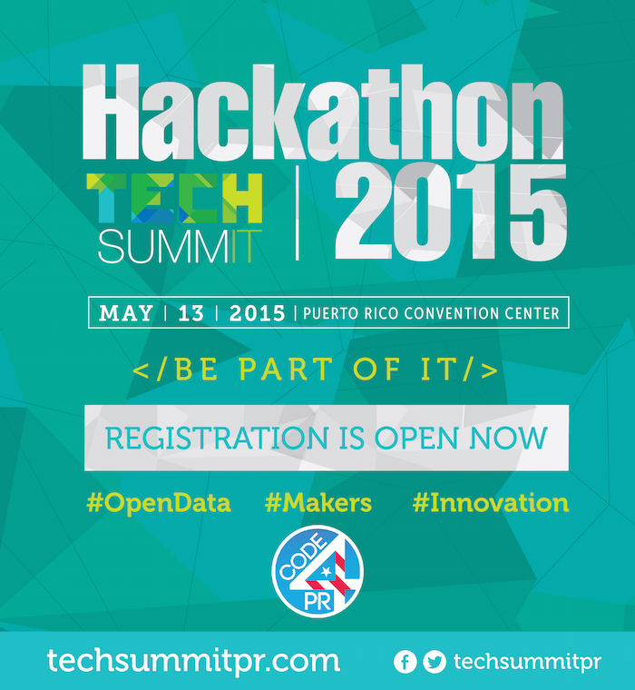

# Tech Summit 2015 Hackathon Rules, Tracks and FAQ

## General Rules

The Tech Summit 2015 Hackathon promotes the design, development and prototyping of civic and entrepreneur ideas.

We encourage all projects to consider government (at all levels), citizens and civic organizations as their user/market base.  Whether civic or not, try to think about your project idea with a venture and entrepreneur mindset.

Feel free to use software, data or hardware to design, develop and implement your prototype.

All project's code, design, schematics and documentation must be forked by the [Commonwealth of Puerto Rico's Github account](https://github.com/commonwealth-of-puerto-rico).  Each project must select an approved open source license to participate at the Tech Summit.  If a project does not specify a particular open source license, the MIT license will be assumed by default.  Projects failing to be forked or that specify a non open source license will not be able to present a demo or compete for any categories or prizes at the Tech Summit.

## Hackathon Tracks

Projects and challenges are encouraged to be created with the following tracks and guidelines:

### Data Hack

- Includes projects based on data gathering, visualization or a creative use of an existing dataset.
- The use of datasets from Data.PR.gov is encouraged but not enforced.
- Existing open datasets from municipal, state or federal government is permitted if used in a context relevant to Puerto Rico.
- Projects that provide mechanisms for gathering or collecting data that is not currently open will be considered under this category.

### Maker Hack

- Includes projects that integrate open hardware and/or 3D printing tools or technics.
- The use of any open hardware platform is permitted.
- Participants are allowed to bring their own hardware, boards, sensors and parts.
- Design, schematics and source code for your application, hardware or 3D print must be pushed in the project's repository.
- Projects must be original.

### Innovative Hack

- Includes any technology project that includes software, either web or mobile.
- Participants are encouraged to give a business twist to their projects, but this is not required.
- Projects that use open data, hardware or 3D printing, but are considered innovative enough by the Hackathon Evaluation Panel, may be considered under this category.  Rules defined for the Data Hack and Maker Hack also apply to projects under the Innovative Hack.

## Hackathon Evaluation Panel

The _Hackathon Evaluation Panel_ consist of members designated by the Tech Summit 2015 Hackathon organizers that will evaluate projects for compliance with the event rules and guidelines.  Any decisions taken by the _Hackathon Evaluation Panel_ in regard to a project compliance are considered final and binding.

The _Hackathon Evaluation Panel_ will be composed of 3 members which will be announced before the Hackathon event begins.

## Hackathon Judging Panel

The _Hackathon Judging Panel_ will evaluate the projects and decide which is the winner for each of the specified tracks.  Any other available prizes will be awarded by the _Hackathon Judging Panel_ and the _Tech Summit Organizing Committee_.

The _Hackathon Judging Panel_ will be composed of a Community Representative, a Government Representative and a Tech Summit 2015 Speaker.

The Prizing Ceremony for the Tech Summit 2015 Hackathon will take place at a different date and venue.  Details on the final date and location will be properly announced via email, social networks and Challenge Post.  Don't worry, you won't miss it!

## FAQ

### Must I bring my laptop?

  Every participant must bring it's own laptop to the event.  Feel free to use the operating system and tools that better suits you.

  _**Be warned, if you don't bring your laptop you may not be allowed to participate.**_

### Must I use a particular programming language, software or platform?

  No.  Use the operating system, programming language, software, tools and platforms that better suits you, your team and your project.

  _**The only requirement for participants is to have a Github account in order to push their code, designs or schematics.**_

### Will I get help during the Hackathon?

  We will have mentors and staff assisting during the hackathon, but don't expect them to teach you how to program, use Git or install any software during the event.

  Mentors and staff priority is to assist hackers with open data issues, makers questions, clarify guidelines and assess projects or ideas.

  We kindly invite you to the _Hackers Preparation event_ that will occur a few days before the Tech Summit in order to clarify any technical issues, create your Github account and make sure your computer is properly setup.

### Don't know Git, how to use Github or don't have an account, can you help me?

  It is very important that you (or at least someone in your team) have a Github account in order to push your project's code, design or schematics.

  If you don't know Git, we recommend that you start with the [TryGit](https://try.github.io/) tutorial. _(No software required.  Just your browser!)_

  We also suggest that you participate in the _Hackers Preparation Event_ that will occur a few days before the Tech Summit in order to setup Git and create your Github account.

### Don't know how to use Data.PR.gov, can you teach me?

  Data.PR.gov is the open data platform used by the Commonwealth of Puerto Rico in order to publish and maintain its open data efforts.

  We recommend that you start with the [Video Guides](https://data.pr.gov/videos) published in their website in order to play with the datasets.

  We also suggest that you participate in the _Hackers Preparation Event_ that will occur a few days before the Tech Summit in order to learn the Data.PR.gov fundamentals from one of our mentors.

### Is there going to be a Hackers Preparation event?

  Yes.  There will be a _Hackers Preparation event_ that will occur a few days before the Tech Summit.

  This will be the event where you can get help installing Git, setting up your computer, creating your Github account, playing with Data.PR.gov, and with any other technical issue.

### Are there going to be any 3D printers available?

  Yes.  There will be a very limited amount of 3D printers.  Consider printers availability and the time that your project may take to print when deciding your project idea and scope.

### Are there going to be any Arduinos, Raspberry Pi, or any hardware available?

  We may have a few, but you should bring your own hardware if considering the _Makers Hack_.

### Must I use an open source license for my project?

  As stated in the Tech Summit 2015 Hackathon General Rules, in order for a project to participate in the demo or compete for any categories or prices it must have an approved open source license.

  We suggest the following licenses for your projects:

  - [**MIT License**](http://choosealicense.com/licenses/mit/)  
  `If you want a simple and permisive license`
  - [**Apache License**](http://choosealicense.com/licenses/apache-2.0/)  
  `If you are concerned about patents`
  - [**GPL 2.0 License**](http://choosealicense.com/licenses/gpl-2.0/) **/** [**GPL 3.0 License**](http://choosealicense.com/licenses/gpl-3.0/)  
  `If you care about sharing improvements`

  For more information about open source licenses, we recommend the following resources:

  - **Github's _Choose a License Guide_** » http://choosealicense.com/
  - **Open Source Initiative** » http://opensource.org/licenses/

### But why OPEN?

  We truly believe that Government should [_Default to Open_](https://playbook.cio.gov/#play13), so we set the example.

  Openness has many benefits, not only for you, but for the technology ecosystem and communities in Puerto Rico.  It allows for collaboration, and enables citizens, entrepreneurs, nonprofits, and government to easily contribute and reuse technology.  Many projects and companies have [opted for openness](https://github.com/explore).

### What if I don't want to use an open source license for my project?

  No worries, but your project will not be eligible to for the demo session nor be eligible to participate in any categories or prizes.

### How can I register for the Tech Summit Hackathon?

  _**The only way to register for the Tech Summit 2015 Hackathon is via [EventBrite](https://www.eventbrite.com/e/tech-summit-2015-innovation-driven-hub-tickets-15734340837).**_

  EventBrite registration is required in order to guarantee seats, internet service and lunch for all participants.

### Can I participate in the Tech Summit Hackathon if not registered via EventBrite?

  _**No.**_  EventBrite registration is required in order to guarantee seats, internet service and lunch for all participants.

### Can I participate in the Tech Summit Hackathon if I only registered in Challenge Post?

  _**No.**_  EventBrite registration is required in order to guarantee seats, internet service and lunch for all participants.

  Participants are required to have a Challenge Post account in order to accept the hackathon rules and guidelines.  Projects and teams must be defined in the event's Challenge Post page.

### Must I pay in order to participate in the Hackathon?

  _**No.  Participation in the Tech Summit 2015 Hackathon is FREE.  Seats are limited and registration is required.**_

### Is there going to be lunch or snacks for the hackers?

  _**Yes.**_  Snacks and lunch will be available for all registered hackers, thanks to the Tech Summit 2015 sponsors.

  EventBrite registration is required in order to guarantee seats, internet service and lunch for all participants.

### Can I enter the Plenary Session with the Hackathon pass?

  _**No.  The Hackathon Pass only gives access to the Hackathon event.**_

  TV displays will be available in the Hackathon area for the participants enjoyment.

  _**Remember, if you don't bring your laptop you may not be allowed to participate.**_

### What if I only want to go and watch the hackers?

  Seats, lunch and internet service are only available to registered participants.  Stay tuned for the live streaming details and announcement.

### Is there going to be live streaming of the Tech Summit?

  Yes.  Stay tuned for the live streaming details and announcement.

### Can the press cover the Hackathon event?

  If you work for media, please contact the Tech Summit 2015 organizers:

  - Milestone Communications:  1-787-641-2164
  - Email:  info@techsummitpr.com

## License

Copyright (c) 2015 Code 4 Puerto Rico.

The _Tech Summit 2015 Hackathon Rules, Tracks and FAQ_ were developed by [Alberto A. Colón Viera](http://alberti.co), the [Code 4 Puerto Rico Core Team](http://code4puertorico.org) and the [Tech Summit Organizing Committee](http://techsummitpr.com).

This work is licensed under a [Creative Commons Attribution-ShareAlike 4.0 International License](http://creativecommons.org/licenses/by-sa/4.0/).
